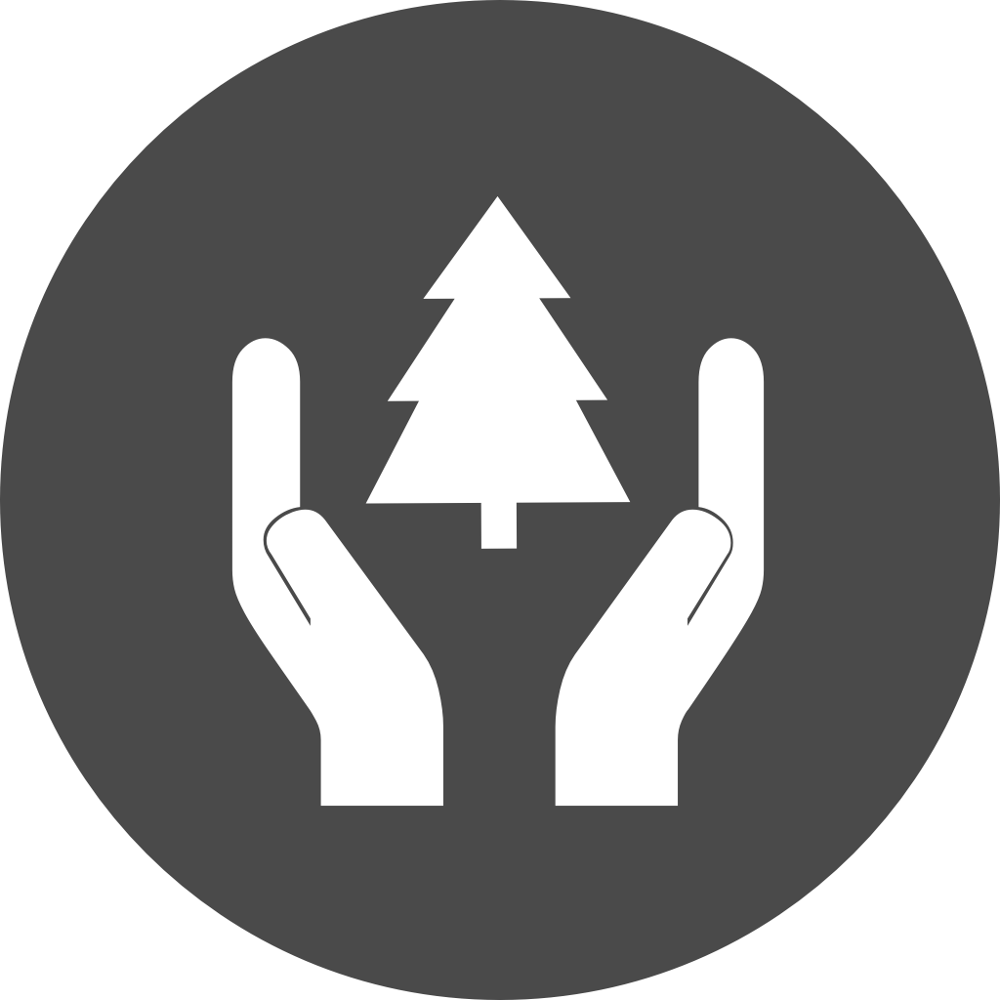
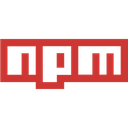
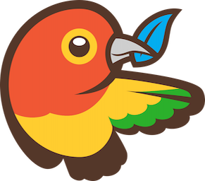
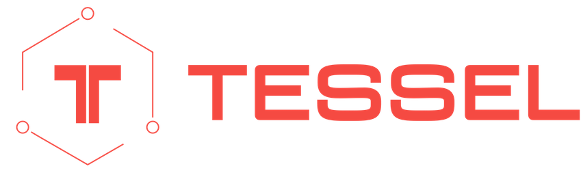

# JavaScript enviroments logo



A collection with logos of enviroments where your JavaScript file might run or
be available, like back-end enviroments — node.js, io.js — or package
managers — npm, bower.

All icons are available in differents sizes, ranging from 32 to 1024 pixels in
height. SVG, EPS and PDF formats are available as well. To download them, use
this
[link](https://github.com/caiogondim/javascript-environments-logos/archive/master.zip).

This repo was made mainly to be used with the
[browser logos](https://github.com/alrra/browser-logos) made by
[@alrra](https://github.com/alrra) in GitHub project's README pages, like
[this](https://github.com/caiogondim/js-patterns-sublime-snippets).


<!----------------------------------------------------------------------------->
## Usage

You can download the icons or link directly to this repo.

To use them in a table inside your README file, choose the logos you want to use
and do something like the example below:

```markdown
<a href="https://nodejs.org"></a> | <a href="https://iojs.org"></a>
--- | ---
0.10+ ✔ | 1.0+ ✔
```

Or take a look in the [raw file](https://raw.githubusercontent.com/caiogondim/javascript-environments-logos/master/readme.md)
of this README file and get the pieces you want.


<!----------------------------------------------------------------------------->
## Examples

### Browser support

<a href="http://www.google.com/chrome/"></a> | <a href="http://firefox.com"></a> | <a href="http://windows.microsoft.com/en-GB/internet-explorer/download-ie"></a> | <a href="http://opera.com"></a> | <a href="http://www.apple.com/safari/"></a>
--- | --- | --- | --- | --- | --- | ---
Latest ✔ | Latest ✔ | 8+ ✔ | Latest ✔ | 6.0+ ✔ | 0.10+ ✔ | 1.0+ ✔

### Server support

<a href="https://nodejs.org"></a> | <a href="https://iojs.org"></a> | <a href="tessel/t/square/128x128.png"></a>
--- | --- | ---
0.10+ ✔ | 1.0+ ✔ | Latest ✔

### Package available on

[npm](https://npmjs.com) | [Bower](http://bower.io)
|:---:|:---:|
| <a href="npm/square/128x128.png"></a> | <a href="bower/standard/291x256.png"></a>


<!----------------------------------------------------------------------------->
## Logos

### [node.js](http://nodejs.org/)

| Standard
|:---:
| <a href="node.js/standard/454x128.png"></a>

### [io.js](https://iojs.org)

| Standard
|:---:
| <a href="iojs/standard/112x128.png"></a>

### [Tessel](https://tessel.io/)

| T | Horizontal
|:---:|:---:
| <a href="tessel/t/square/128x128.png"></a> | <a href="tessel/horizontal/without-padding/849x256.png"></a>

### [npm](https://www.npmjs.com/)

| Square | Standard
|:---:|:---:
| <a href="npm/square/128x128.png"></a> | <a href="npm/original/657x256.png"></a>

### [Bower](http://bower.io)

| Standard
|:---:
| <a href="bower/standard/291x256.png"></a>


<!----------------------------------------------------------------------------->
## Credits

- Icon: [Donata Bologna](http://thenounproject.com/term/conservation/1909/)
