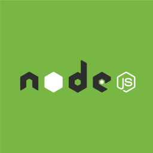

### node.js

| [standard light](http://nodejs.org/) | [standard dark](http://nodejs.org/) | [standard green](http://nodejs.org/)
|:---:|:---:|:---:|
|  |  |  |

### io.js

| Standard
|:---:
| 

### Tessel

| [T](https://tessel.io/) | [Horizontal](https://tessel.io/)
|:---:|:---:
|  | 

### npm

| [Square](https://npmjs.com/) | [Standard](https://npmjs.com/)
|:---:|:---:
|  | 
